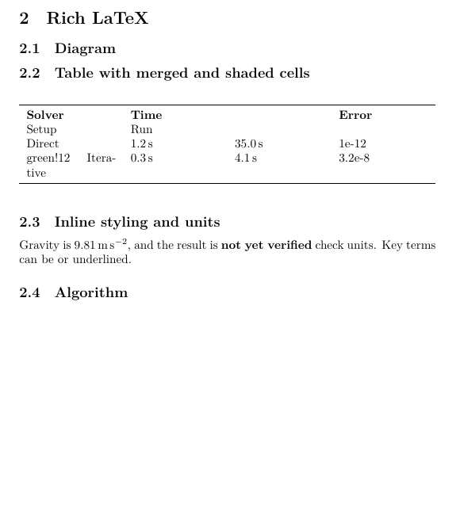
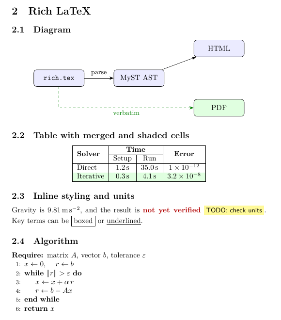
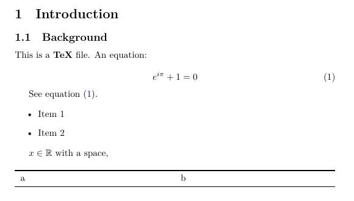
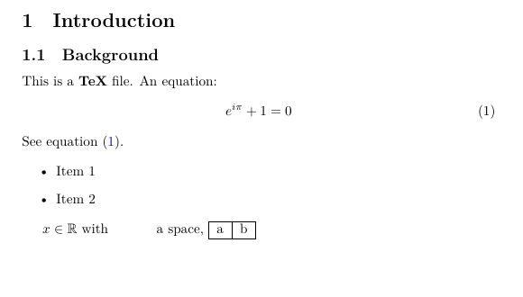

# myst-tex

A plugin and template for [MyST](https://mystmd.org) projects that load `.tex` files directly from the TOC
and **pass the original TeX source through verbatim to LaTeX/PDF exports**.

MyST can read `.tex` files, but when exporting to LaTeX/PDF it first converts them to the MyST AST and then
writes LaTeX back out. Commands like `\hspace` and `\vspace` are dropped, and `tabular` and `\eqref` are rewritten.
With this plugin, the HTML site still shows the content as parsed by MyST, while LaTeX/PDF exports receive
the original source.

| | Without plugin | With plugin |
|---|---|---|
| `\hspace{1cm}`, `\vspace{2mm}` | Dropped | Kept as is |
| `\begin{tabular}{\|c\|c\|}` + `\hline` | Rewritten to `p{...}` columns + `\toprule` | Kept as is |
| `\eqref{eq:euler}` | `(\ref{eq:euler})` | Kept as is |
| HTML rendering and cross-references | Work | Work (unchanged) |

## Examples: PDF output with and without the plugin

Each example compares a page of the PDF built with the same template and content.
The only difference is whether the plugin is listed in `myst.yml`.

### Rich LaTeX

[`chapters/rich.tex`](chapters/rich.tex) uses features that MyST's TeX parser does not support:
a TikZ diagram, a table with `\multirow`/`\multicolumn` and `\rowcolor`, `\colorbox`/`\textcolor`/`\fbox`,
a custom macro with an argument (`\todo{...}`), `siunitx` units, and `algpseudocode`.

| Without plugin | With plugin |
|---|---|
|  |  |

| Feature | Without plugin | With plugin |
|---|---|---|
| TikZ diagram | Missing | Rendered |
| Table with merged and shaded cells | Cells flattened into a plain table; `green!12` printed as text | Rendered as written |
| `\num{1e-12}` | Printed as `1e-12` | $1 \times 10^{-12}$ |
| `\textcolor`, `\colorbox`, `\fbox`, `\todo{...}` | Color and boxes dropped; "boxed" missing | Rendered |
| `algorithmic` pseudocode | Missing | Rendered with line numbers |

### Spacing and simple tables

[`chapters/intro.tex`](chapters/intro.tex) ends with:

```latex
$x \in \R$ with \hspace{1cm} a space,\vspace{2mm}
\begin{tabular}{|c|c|}\hline a & b \\\hline\end{tabular}
```

| Without plugin | With plugin |
|---|---|
|  |  |

- **Without the plugin**, `\hspace{1cm}` is dropped, and the `tabular` is rewritten as a full-width
  `booktabs` table on its own line, without the `|c|c|` borders or `\hline`.
  "See equation (1)." also starts a new indented paragraph, because the paragraph is split after the equation.
- **With the plugin**, the source is typeset exactly as written: the 1cm gap, the boxed inline table,
  and "See equation (1)." continuing the paragraph after the equation.

### Regenerating the images

Run `npm run compare` (requires LuaLaTeX, latexmk, and `pdftoppm`/`pdfinfo` from poppler).
It writes both PDFs and an image of every page after the title page to `_build/compare/`.
CI also runs it and uploads the results.

## Usage

```sh
npm install
npm run start          # HTML preview (http://localhost:3000)
npx myst build --tex   # _build/exports/book.tex
npx myst build --pdf   # _build/pdf/book.pdf (requires LuaLaTeX and latexmk)
npm test
```

Register the plugin and template in `myst.yml`, and list `.tex` files in the TOC:

```yaml
project:
  plugins:
    - plugins/tex-passthrough.mjs
  toc:
    - file: index.md
    - file: chapters/intro.tex
    - file: chapters/methods.md
  exports:
    - format: pdf
      template: templates/tex-passthrough
      output: _build/pdf/book.pdf
```

## Writing `.tex` pages

```latex
\title{Introduction}
\subsection{Background}\label{sec:intro}

Body text. See equation~\eqref{eq:euler}.
\begin{equation}\label{eq:euler}
  e^{i\pi} + 1 = 0
\end{equation}
```

- Write only the body: no `\documentclass` or `\begin{document}`.
- A leading `\title{...}` becomes the page title (the HTML sidebar entry, and `\section{...}` in LaTeX exports).
  The plugin removes the `\title` line from the passed-through source. Without it, the sidebar shows the file name.
- Since the page title becomes a `\section`, start headings inside the file at `\subsection`.
- `\label`s can be referenced from Markdown pages, e.g. `[](#sec:intro)`.

## How it works

`plugins/tex-passthrough.mjs` wraps the entire AST of each `.tex` page in a single `raw` node:

```js
{ type: 'raw', tex: '<original TeX source>', children: [/* AST parsed by MyST */] }
```

mystmd's LaTeX writer outputs the `tex` value of a `raw` node verbatim, while HTML and other outputs
render its `children`.

## Template

`templates/tex-passthrough/` is based on mystmd's standard `plain_latex` template.
Because mystmd does not render the passed-through body itself, it no longer adds packages such as `amsmath`
automatically, so the template loads the packages the body needs.

- Included: `amsmath`, `amssymb`, `luatexja`, `xcolor` (with the `table` option), `tikz` (with the `arrows.meta` and `positioning` libraries), `multirow`, `siunitx`, `algpseudocode`
- The PDF engine is LuaLaTeX (`build.engine` in `template.yml`); Japanese text is typeset with `luatexja`.
- To use other packages, add a `\usepackage` line to `template.tex` and list the package under `packages` in `template.yml`.

## Tests

`npm test` checks the following. GitHub Actions installs TeX Live and also builds the PDF.

- `test/plugin.test.mjs`: the plugin in isolation (leaves non-`.tex` files alone, wraps pages in a `raw` node, removes `\title`)
- `test/build.test.mjs`: builds the sample and checks that the LaTeX output matches the original source, and that HTML rendering and cross-references work
- `test/pdf.test.mjs`: builds the PDF (skipped when `latexmk` is not installed)

## Limitations

- Only `.tex` pages are passed through. Markdown pages are still converted to LaTeX by MyST.
- The plugin only changes LaTeX/PDF output. The HTML site still shows MyST's parse of each `.tex` page, so features MyST cannot handle look the same as in the "Without plugin" column above (for example, the TikZ diagram is missing). They also produce `Unhandled TEX conversion` errors during the build. These do not affect LaTeX output.
- Paths in `\input` and `\includegraphics` are not rewritten. Output is written under `_build/`, so paths relative to the source file may not resolve.
- The plugin relies on mystmd internals (the LaTeX writer printing a `raw` node's `tex` verbatim). Tested with mystmd v1.11.0.
